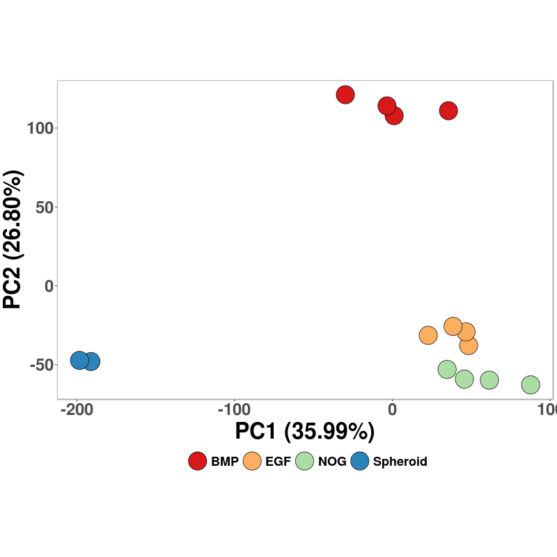
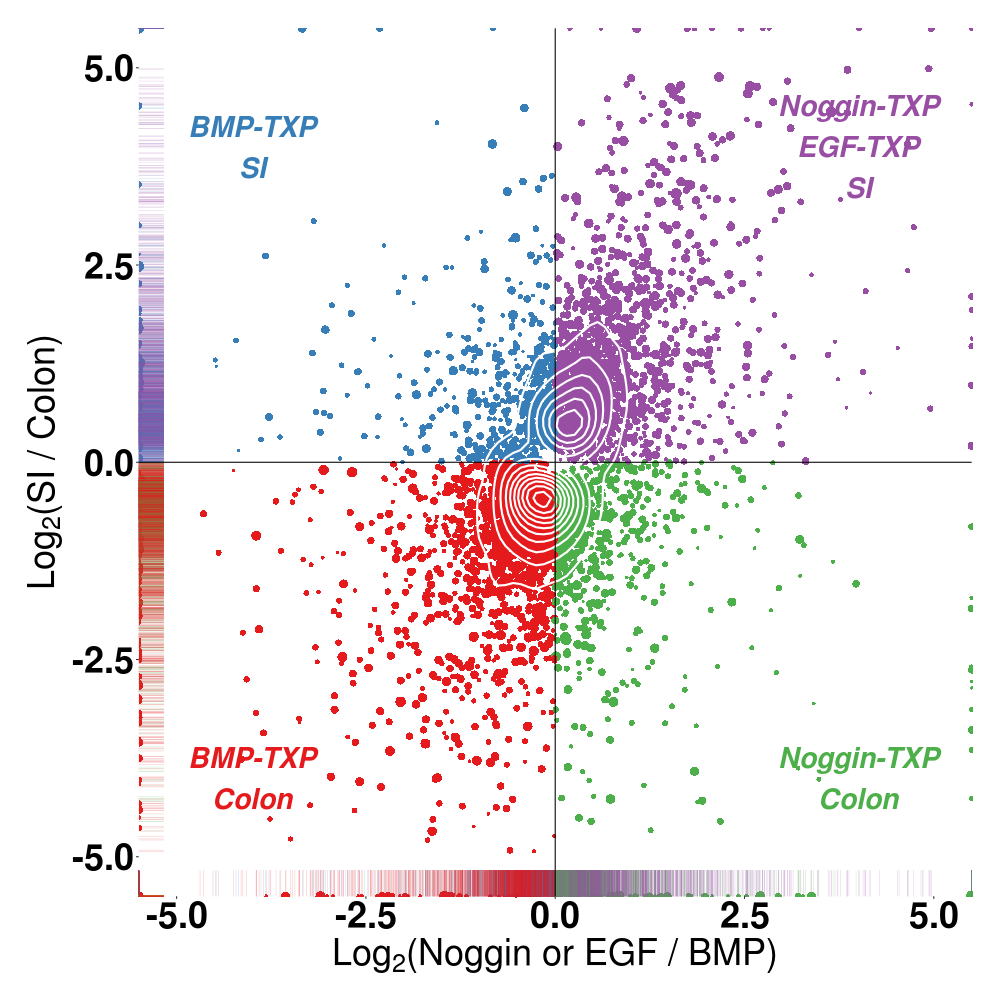
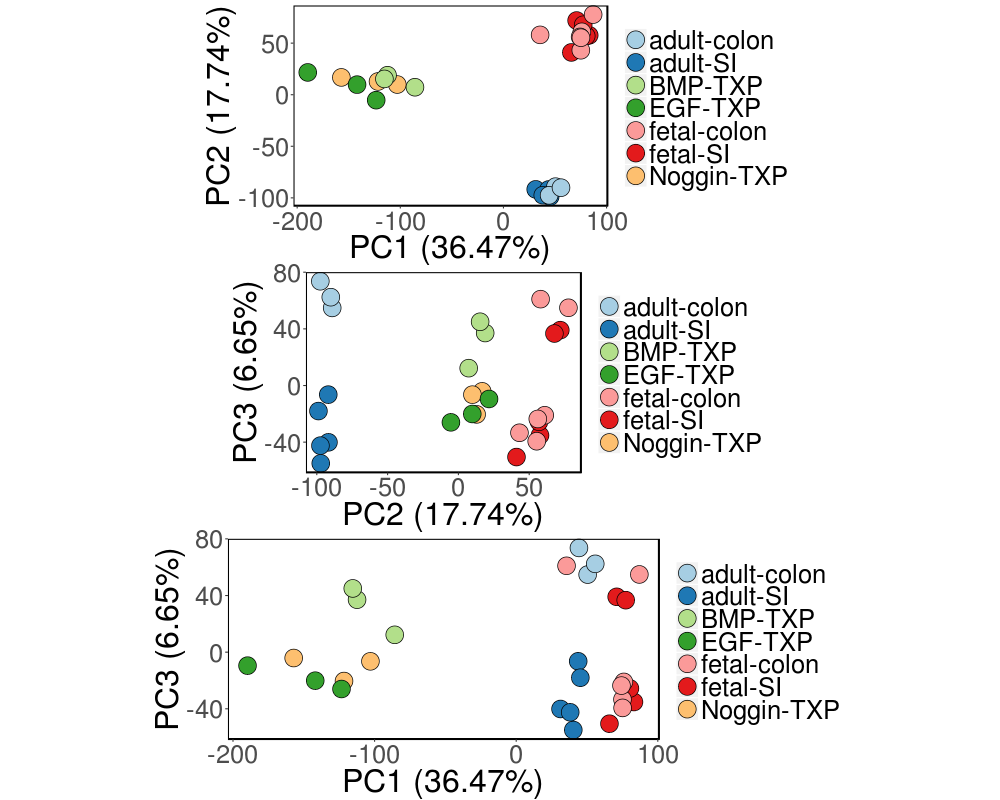

**Manipulation of a conserved BMP-HOX pathway promotes formation of human large intestinal organoids.**

Jorge O. Múnera<sup>1</sup>, Nambirajan Sundaram<sup>2</sup>, Carey Watson<sup>2</sup>, Scott A. Rankin<sup>1</sup>, Maxime Mahe<sup>2</sup>, Jefferson E. Vallance<sup>3</sup>, Noah F. Shroyer<sup>3</sup>, Katie L. Sinagoga<sup>1</sup>, Adrian Zarsozo-Lacoste<sup>1</sup>, Jonathan R. Hudson<sup>1</sup>, Jonathan C. Howell<sup>5</sup>, David Hill<sup>6</sup>, Praneet Chatuvedi<sup>1</sup>, Jason R. Spence<sup>6</sup>, John M. Shannon<sup>4</sup>, Aaron M. Zorn<sup>1</sup>, Michael Helmrath<sup>2</sup> and James M. Wells<sup>1,5*</sup>. 

Divisions of 1 Developmental Biology, 2 Surgery, 3 Gastroenterology, 4
Pulmonary Biology and 5 Endocrinology. Cincinnati Children’s Hospital
Research Foundation, Cincinnati, OH 45229. 6 University of Michigan, Ann
Arbor MI 48109.

\*Author for correspondence: james.wells@cchmc.org

Materials and Methods
=====================

Public RNA-seq accession numbers
--------------------------------

Adult small intestine and large intestine RNA-seq data were downloaded
from the public database E-MTAB-1733. Accession numbers for the small
intestine samples: ERR315344, ERR315381, ERR315409, ERR315442,
ERR315461. Accession numbers for the large intestine samples: ERR315348,
ERR315357, ERR315484.

Organoid and spheroid RNA-seq data are available at **E-MTAB-5658**

RNA-seq sequence assembly abundance estimation
----------------------------------------------

The quality of the Illumina sequencing run was evaluated by analyzing
FASTQ data for each sample using FastQC version 0.10.1 [@Andrews:2010]
to identify features of the data that may indicate quality problems
(e.g. low quality scores, over-represented sequences, inappropriate GC
content, etc.). No major issues were identified by the QC analysis. We
used the software package Tuxedo Suite for alignment, differential
expression analysis, and post-analysis diagnostics. Briefly, we aligned
reads to the reference transcriptome (UCSC hg19) using TopHat version
2.0.13 and Bowtie version 2.2.5 [@Langmead:2009]. We used default
parameter settings for alignment, with the exception of:
“--b2-very-sensitive” to maximize the accuracy of the read alignment, as
well as “--no-coverage-search” and “--no-novel-juncs” limiting the read
mapping to known transcripts. Cufflinks version 2.2.1 [@Trapnell:2012]
was used for RNA abundance estimation. UCSC hg19.fa was used as the
reference genome sequence and UCSC hg19.gtf was used for transcriptome
annotation. We applied the following parameters in Cufflinks:
“--multi-read-correct” to adjust expression calculations for reads that
map in more than one locus, and “--compatible-hits-norm” and
“--upper-quartile –norm” for normalization of expression values.
Normalized FPKM tables were generated using the CuffNorm function. RNA
sequence assembly and transcriptional analysis was conducted using the
64-bit Debian Linux stable version 7.10 ("Wheezy") platform.

Differential expression analysis
--------------------------------

All plots and statistical analyses were conducted in
`R.Version()$version.string`{.r .rundoc-block rundoc-language="R"
rundoc-session="*R*" rundoc-exports="results" rundoc-results="text"}.
Plots were generated using the R package 'ggplot2' [@Wickham:2009].
Differential expression analysis and statistical tests of Cufflinks
output were completed with the R package 'SeqRetriever' version 0.6
[@Hill:2016]. Hypergeometric means testing was used to evaluate relative
enrichment of shared gene expression signatures between groups using the
R package 'GeneOverlap' [@Shen2013]. The complete RNA-seq FASTQ
processing pipeline and analysis scripts are available at
<https://github.com/hilldr/Munera2017>.

Required hardware and software
------------------------------

### Hardware

The analysis machine has the following characteristics:

-   OS: Debian 7.9 wheezy
-   Kernel: x86~64~ Linux 3.2.0-4-amd64
-   Shell: bash 4.2.37
-   CPU: Intel Xeon CPU E5504 @ 2GHz
-   GPU: Quadro FX 380
-   RAM: 48340MB

### Software

The code is intended for the UNIX environment. The following software is
required to execute the analysis
-   FastQC v0.11.3
-   Bowtie 2 version 2.2.5
-   cufflinks v2.2.1
-   R version 3.2.2 (2015-08-14) -- "Fire Safety"

Scripts and github page prepared using GNU Emacs 25.1.2 with Org-mode
version 8.2.10

Figure 2J
---------

### PCA (Praneet dataset)

``` {.r .rundoc-block rundoc-language="R" rundoc-session="*R*" rundoc-exports="both" rundoc-results="graphics" rundoc-file="./RESULTS/PCA-Praneet.png" rundoc-width="800" rundoc-height="800" rundoc-eval="yes"}
## PCA analysis (Praneet data) ------------------------------------------------------
## Load dataset from file
df <- readr::read_csv(file = "./RESULTS/Genes_TPM_matrix-Praneet.csv")

## subset to columns with numeric values
num.data <- df[,sapply(df,is.numeric)]
group <- substr(colnames(num.data), 1, nchar(colnames(num.data))-1)

## calculate variance by row (gene)
var <- apply(num.data, 1, sd, na.rm=TRUE)
## adjust cut off according to variance percentile
pca.data <- num.data[var > quantile(var, 0.1) & var != 0,]
pca <- prcomp(t(pca.data),scale = TRUE,center = TRUE)
scores <- data.frame(colnames(pca.data), pca$x[,1:ncol(pca$x)], group)

## PCA plot
## function to format decimals as precentage
percent <- function(x, digits = 2, format = "f", ...) {
  paste0(formatC(100 * x, format = format, digits = digits, ...), "%")
}

## plot theme
library(ggplot2)
## Load standard theme ----------------------------------------------------------
library(ggplot2)
library(grid)
theme1 <-  theme(axis.text.x = element_text(size = 24,
                                            angle = 0,
                                            hjust = 0.5,
                                            face = "bold"),
                 axis.text.y = element_text(size = 24,
                                            face = "bold",
                                            hjust = 1),
                 legend.position = "none",
         legend.key = element_rect(fill = "white"),
                 panel.background = element_rect(fill = "white"),
                 plot.subtitle = element_text(size = 26, hjust = 0.5, face = "bold"),
                 panel.grid.major = element_blank(),
                 panel.grid.minor = element_blank(),
                 axis.title = element_text(size = 32,
                                           face = "bold"),
                 axis.title.y = element_text(vjust = 1.5),
                 axis.title.x = element_text(vjust = -0.5),
                 legend.title = element_blank(),
         panel.border = element_rect(fill = NA,
                                              color = "grey70",
                                              size = 1),
                 plot.title = element_text(size = 45,
                                           face = "bold",
                                             hjust = 0),
                 legend.text = element_text(size = 18,
                                            face = "bold"))


library(ggplot2)
library(RColorBrewer)
fig1c <- qplot(x = PC1, y = PC2, data = scores) +  

    scale_fill_brewer(palette = "Spectral") +
    geom_point(shape = 21, aes(fill = group), size = 12) +
    theme1 +
    theme(legend.position="bottom",
          legend.background = element_rect(colour = "white"),
          legend.key = element_rect(color = "white",fill = "white"))+
    coord_fixed(ratio = 1) +
    xlab(paste("PC1 (",percent(round(summary(pca)$importance[2,1],4)),")",sep = "")) +
    ylab(paste("PC2 (",percent(round(summary(pca)$importance[2,2],4)),")",sep = ""))

print(fig1c)
```



Figure 7
--------

### Cufflinks processing pipeline

#### Header

``` {.bash .rundoc-block rundoc-language="sh" rundoc-export="code" rundoc-eval="no" rundoc-tangle="./src/Munera-revisions.sh"}
#! /bin/bash
GENES=/data/genomes/hg19_genes_refFlat.gtf
GENOME=/data/genomes/hg19.fa
INDEX=/data/genomes/hg19
EMAIL=d2.david.hill@gmail.com
```

#### FastQC processing

``` {.bash .rundoc-block rundoc-language="sh" rundoc-export="code" rundoc-eval="no" rundoc-tangle="./src/Munera-revisions.sh"}
#FASTQC quality control report generator
mkdir ../DATA/QC
for file in ../DATA/FASTQ/*.fastq* # will output filename as "$file"
do
    FILENAME="$file"       
    fastqc --outdir=../DATA/QC $FILENAME
done
```

#### Tophat/Bowtie processing

``` {.bash .rundoc-block rundoc-language="sh" rundoc-export="code" rundoc-eval="no" rundoc-tangle="./src/Munera-revisions.sh"}
#! /bin/bash
mkdir ../DATA/BAM
for file in ../DATA/FASTQ/*.fastq*
do
    SHORTNAME=$(basename "$file")
    NAME2="${SHORTNAME##*/}"
    DIRNAME="${NAME2%.*}"
    tophat2 -p 8 --b2-very-sensitive --no-coverage-search --no-novel-juncs --GTF $GENES -o ../DATA/BAM/$DIRNAME $INDEX $file
done
```

#### Cufflinks processing

``` {.bash .rundoc-block rundoc-language="sh" rundoc-export="code" rundoc-eval="no" rundoc-tangle="./src/Munera-revisions.sh"}
#! /bin/bash
for d in ../DATA/BAM/*/
do
    FILENAME="$file"       #set variable FILENAME equal to file from line 1
    SHORTNAME=$(basename "$file")
    NAME2="${SHORTNAME##*/}"
    DIRNAME="${d}"
    cufflinks -p 8 -o $DIRNAME --multi-read-correct --compatible-hits-norm --upper-quartile-norm --GTF $GENES ${d}*hits.bam
done
```

##### Merged transcriptome setup file

``` {.bash .rundoc-block rundoc-language="sh" rundoc-export="code" rundoc-eval="no" rundoc-tangle="./src/Munera-revision_assembly.txt"}
../DATA/BAM/run1205_lane12_read1_indexD708-D501=NogginTXP9.fastq/transcripts.gtf
../DATA/BAM/run1205_lane12_read1_indexD708-D503=NogginTXP5.fastq/transcripts.gtf
../DATA/BAM/run1205_lane12_read1_indexD708-D504=NogginTXP4.fastq/transcripts.gtf
../DATA/BAM/run1205_lane12_read1_indexD708-D505=NogginTXP3.fastq/transcripts.gtf
../DATA/BAM/run1205_lane12_read1_indexD709-D502=5331BMPTXP.fastq/transcripts.gtf
../DATA/BAM/run1205_lane12_read1_indexD709-D503=5330BMPTXP.fastq/transcripts.gtf
../DATA/BAM/run1205_lane12_read1_indexD709-D507=4904BMPTXP.fastq/transcripts.gtf
../DATA/BAM/ERR315344_merged/transcripts.gtf
../DATA/BAM/ERR315381_merged/transcripts.gtf
../DATA/BAM/ERR315409_merged/transcripts.gtf
../DATA/BAM/ERR315442_merged/transcripts.gtf
../DATA/BAM/ERR315461_merged/transcripts.gtf
../DATA/BAM/ERR315348_merged/transcripts.gtf
../DATA/BAM/ERR315357_merged/transcripts.gtf
../DATA/BAM/ERR315484_merged/transcripts.gtf
../DATA/BAM/run1209_lane912_read1_indexD706-D505=5631EGFTXP.fastq/transcripts.gtf 
../DATA/BAM/run1209_lane912_read1_indexD706-D504=5632EGFTXP.fastq/transcripts.gtf
../DATA/BAM/run1205_lane12_read1_indexD709-D501=5630EGFTXP.fastq/transcripts.gtf
../DATA/BAM/SRR643760.fastq/transcripts.gtf
../DATA/BAM/SRR643746.fastq/transcripts.gtf
../DATA/BAM/SRR643747.fastq/transcripts.gtf
../DATA/BAM/SRR643756.fastq/transcripts.gtf
../DATA/BAM/SRR643758.fastq/transcripts.gtf 
../DATA/BAM/Sample_SRR643755_R1.fastq/transcripts.gtf 
../DATA/BAM/Sample_SRR643757_R1.fastq/transcripts.gtf 
../DATA/BAM/Sample_SRR643759_R1.fastq/transcripts.gtf 
../DATA/BAM/Sample_SRR643761_R1.fastq/transcripts.gtf 
../DATA/BAM/Sample_SRR643745_R1.fastq/transcripts.gtf 
../DATA/BAM/Sample_SRR643748_R1.fastq/transcripts.gtf  
```

#### Cuffmerge/Cuffquant processing

``` {.bash .rundoc-block rundoc-language="sh" rundoc-export="code" rundoc-eval="no" rundoc-tangle="./src/Munera-revisions.sh"}
#! /bin/bash
cuffmerge -g $GENES -s $GENOME -p 8 -o ../DATA/merged_asm Munera-revision_assembly.txt
for d in ../DATA/BAM/*/
do
    FILENAME="$file"       #set variable FILENAME equal to file from line 1
    SHORTNAME=$(basename "$file")
    NAME2="${SHORTNAME##*/}"
    DIRNAME="${d}"
    cuffquant -p 8 -o $DIRNAME --max-mle-iterations 100000 -v --multi-read-correct ../DATA/merged_asm/merged.gtf ${d}*hits.bam
done
```

#### Cuffdiff/Cuffnorm processing

``` {.bash .rundoc-block rundoc-language="sh" rundoc-export="code" rundoc-eval="no" rundoc-tangle="./src/Munera-revisions.sh"}
mkdir ../RESULTS
# CUFFNORM
cuffnorm -o ../RESULTS/Munera-revisions_normout -p 8 -L Noggin-TXP,BMP-TXP,adult-SI,adult-colon,EGF-TXP,fetal-SI,fetal-colon ../DATA/merged_asm/merged.gtf \
../DATA/BAM/run1205_lane12_read1_indexD708-D501=NogginTXP9.fastq/abundances.cxb,../DATA/BAM/run1205_lane12_read1_indexD708-D503=NogginTXP5.fastq/abundances.cxb,../DATA/BAM/run1205_lane12_read1_indexD708-D504=NogginTXP4.fastq/abundances.cxb \
../DATA/BAM/run1205_lane12_read1_indexD709-D502=5331BMPTXP.fastq/abundances.cxb,../DATA/BAM/run1205_lane12_read1_indexD709-D503=5330BMPTXP.fastq/abundances.cxb,../DATA/BAM/run1205_lane12_read1_indexD709-D507=4904BMPTXP.fastq/abundances.cxb \
../DATA/BAM/ERR315344_merged/abundances.cxb,../DATA/BAM/ERR315381_merged/abundances.cxb,../DATA/BAM/ERR315409_merged/abundances.cxb,../DATA/BAM/ERR315442_merged/abundances.cxb,../DATA/BAM/ERR315461_merged/abundances.cxb \
../DATA/BAM/ERR315348_merged/abundances.cxb,../DATA/BAM/ERR315357_merged/abundances.cxb,../DATA/BAM/ERR315484_merged/abundances.cxb \
../DATA/BAM/run1209_lane912_read1_indexD706-D505=5631EGFTXP.fastq/abundances.cxb,../DATA/BAM/run1209_lane912_read1_indexD706-D504=5632EGFTXP.fastq/abundances.cxb,../DATA/BAM/run1205_lane12_read1_indexD709-D501=5630EGFTXP.fastq/abundances.cxb \
../DATA/BAM/SRR643760.fastq/abundances.cxb,../DATA/BAM/SRR643746.fastq/abundances.cxb,../DATA/BAM/SRR643747.fastq/abundances.cxb,../DATA/BAM/SRR643756.fastq/abundances.cxb,../DATA/BAM/SRR643758.fastq/abundances.cxb \
../DATA/BAM/Sample_SRR643755_R1.fastq/abundances.cxb,../DATA/BAM/Sample_SRR643757_R1.fastq/abundances.cxb,../DATA/BAM/Sample_SRR643759_R1.fastq/abundances.cxb,../DATA/BAM/Sample_SRR643761_R1.fastq/abundances.cxb,../DATA/BAM/Sample_SRR643745_R1.fastq/abundances.cxb,../DATA/BAM/Sample_SRR643748_R1.fastq/abundances.cxb
echo "Your Cuffnorm run is complete" | mail -s "Cufflinks complete" $EMAIL

```

#### Email alert

``` {.bash .rundoc-block rundoc-language="sh" rundoc-export="code" rundoc-eval="no" rundoc-tangle="./src/Munera-revisions.sh"}
echo "Your Cufflinks run is complete" | mail -s "Cufflinks complete" $EMAIL
```

### R script

#### Compute Student's t-test results

``` {.r .rundoc-block rundoc-language="R" rundoc-session="*R*" rundoc-results="silent" rundoc-exports="both" rundoc-eval="yes"}

## BE SURE TO RUN './src/install_dependencies.R' prior running this analysis script
## to ensure that you have all the required software 

## Generate FPKM dataframe with Student's t-test results -----------------------
## load SeqRetriever functions
library(SeqRetriever)

## Generate a SeqRetriever dataframe
df <- SeqDataframe(dir = "RESULTS/Munera-revisions_normout")

## Generate Student's t-test results
df.stat <- SeqStudents(df,
                       group1 = "Noggin|EGF",
                       group2 = "BMP")

df.stat <- SeqStudents(df.stat,
                       group1 = "adult-SI",
                       group2 = "adult-colon")

df.stat <- SeqStudents(df.stat,
                       group1 = "fetal-SI",
                       group2 = "fetal-colon")

df.stat <- SeqStudents(df.stat,
                       group1 = "Noggin",
                       group2 = "BMP")

## Minor correction to colnames to avoid conflicts in SeqRetriever
colnames(df.stat) <- gsub("Noggin|EGF", "Noggin.and.EGF", colnames(df.stat))
colnames(df.stat) <- gsub("-", ".", colnames(df.stat))


## setup group (aka "color" for plotting) index                       
 df.stat$color <- ifelse(df.stat$log2.Noggin.and.EGF.ovr.BMP > 0 &      
                             df.stat$log2.adult.SI.ovr.adult.colon > 0, 
                         "Noggin + SI",                                 
                  ifelse(df.stat$log2.Noggin.and.EGF.ovr.BMP < 0 &      
                             df.stat$log2.adult.SI.ovr.adult.colon > 0, 
                         "BMP + SI",                                    
                  ifelse(df.stat$log2.Noggin.and.EGF.ovr.BMP > 0 &      
                             df.stat$log2.adult.SI.ovr.adult.colon < 0, 
                         "Noggin + Colon",                              
                  ifelse(df.stat$log2.Noggin.and.EGF.ovr.BMP < 0 &      
                             df.stat$log2.adult.SI.ovr.adult.colon < 0, 
                         "BMP + Colon", "Not expressed"))))             

## Write to file
write.csv(df, file = "./RESULTS/Munera-revisions_fpkmtable_withStats.csv")

```

[FPKM table](./RESULTS/EGFNogBMPfpkmtable_withStats.csv)

#### Density plot

``` {.r .rundoc-block rundoc-language="R" rundoc-session="*R*" rundoc-exports="both" rundoc-results="graphics" rundoc-file="./RESULTS/BMP-NogginEGF-Si-Colon-figure.png" rundoc-width="1000" rundoc-height="1000" rundoc-eval="yes" rundoc-tangle="./src/expression_analysis.R"}
## Density Plot ----------------------------------------------------------------
library(ggplot2)
library(grid)
library(MASS)
library(scales)
library(RColorBrewer)

## plot theme
theme1 <-  theme(axis.text.x = element_text(color = "black",
                                            size = 36,
                                            angle = 0,
                                            hjust = 0.5,
                                            face = "bold"),
                 axis.text.y = element_text(size = 36,
                                            face = "bold",
                                            hjust = 1,
                                            color = "black"),
                 legend.position = "none",
                 panel.background = element_rect(fill = "white"),
                 panel.grid.major = element_blank(),
                 panel.grid.minor = element_blank(),
                 axis.title = element_text(size = 36,
                                           face = "bold"),
                 axis.title.y = element_text(size = 36,
                                             face = "bold",
                                             vjust = 1.5),
                 axis.title.x = element_text(vjust = -0.5),
                 legend.title = element_blank(),
                 panel.border = element_rect(fill = NA,
                                             color = "black",
                                             size = 0),
                 plot.title = element_text(size = 45,
                                           face = "bold",
                                           hjust = -0.1),
                 legend.text = element_text(size = 18,
                                            face = "bold"),
                 plot.margin = unit(c(1,1,1,1), "cm"))
## Generate color palette 
color.set <- brewer.pal(n = 8, name = "Set1")

## Subset dataset to genes that differ significantly between Noggin & EGF and BMP
## OR between adult small intestine and adult colon
df.sig <- subset(df.stat, df.stat$ttest.Noggin.and.EGF.v.BMP.p < 0.05 | df.stat$ttest.adult.SI.v.adult.colon.p < 0.05)
## In cases where a given gene is significant in Nog v. BMP adn SI v. colon
## use the smaller p-value
df.sig$pmin <- apply(df.sig[,grep(".p", colnames(df.sig))],1, FUN = min)

## Generate plot
fig <- ggplot(data = df.sig,
              aes(x = log2.Noggin.and.EGF.ovr.BMP, y = log2.adult.SI.ovr.adult.colon)) + 
    geom_point(shape = 16, alpha = I(1),
               aes(size = -log10(pmin),
                   color = factor(color))) +
    geom_density2d(size = 1, color = "white") +
    geom_rug(size = 0.25, alpha = 0.25, aes(color = factor(color))) +
    scale_color_manual(values = color.set[1:5]) + 
    geom_vline(xintercept = 0,
               linetype = "solid", color = "black", size = 0.5)+
    geom_hline(yintercept = 0,
               linetype = "solid", color = "black", size = 0.5)+
    xlim(c(-5,5)) + ylim(c(-5,5)) +
    annotate("text", x = 4, y = 4, colour = color.set[4], size = 10,
              lwd = 4, label = "Noggin-TXP\nEGF-TXP\nSI",fontface = "bold.italic") + 
    annotate("text", x = -4, y = 4, colour = color.set[2], size = 10,
              lwd = 4, label = "BMP-TXP\nSI",fontface = "bold.italic") + 
    annotate("text", x = -4, y = -4, colour = color.set[1], size = 10,
              lwd = 4, label = "BMP-TXP\nColon",fontface = "bold.italic") + 
    annotate("text", x = 4, y = -4, colour = color.set[3], size = 10,
              lwd = 4, label = "Noggin-TXP\nColon",fontface = "bold.italic") + 
    labs(x = expression(Log[2]*"(Noggin or EGF / BMP)"),
         y = expression(Log[2]*"(SI / Colon)")) +
    theme1

print(fig) 
```



#### Principle component analysis

``` {.r .rundoc-block rundoc-language="R" rundoc-session="*R*" rundoc-exports="both" rundoc-results="graphics" rundoc-file="./RESULTS/Munera-revisions-PCAfigure.png" rundoc-width="1000" rundoc-height="800" rundoc-eval="yes"}
## Principle Component Analysis ------------------------------------------------
## limit dataframe to numeric columns only
num.data <- df[,sapply(df,is.numeric)]
## Greate group names by removing replicate numbers from column titles
group <- gsub('.{2}$', '', colnames(num.data))
## Remove rows where SD = 0
pca.data <- num.data[apply(num.data, 1, sd, na.rm=TRUE) != 0,]
## PCoA call
pca <- prcomp(t(pca.data),scale = TRUE, center = TRUE)
## create dataframe of PC scores and sample names
scores <- data.frame(colnames(pca.data), pca$x[,1:ncol(pca$x)],group)

library(ggplot2)
library(grid)
library(MASS)
library(scales)
library(RColorBrewer)

## plot theme ------------------------------------------------------------
theme1 <-  theme(text = element_text(size = 32),
                 legend.position = "none",
                 panel.background = element_rect(fill = "white"),
                 panel.grid.major = element_blank(),
                 panel.grid.minor = element_blank(),
                 legend.title = element_blank(),
                 panel.border = element_rect(fill = NA,
                                             color = "black",
                                             size = 0))
## Generate color palette 
color.set <- brewer.pal(n = 8, name = "Paired")

## PCA plot --------------------------------------------------------------------
library(ggplot2)

## Trivial function to format cumulative proportion of variance to pct
percent <- function(x, digits = 2, format = "f", ...) {
  paste0(formatC(100 * x, format = format, digits = digits, ...), "%")
}

## modifications to theme1
theme2 <- theme(legend.position = "right",
               legend.title = element_blank(),
               legend.background = element_rect(fill = "white",
                                                size = 0.5,
                                                linetype = "dotted"),
               panel.grid.minor = element_blank(),
               panel.grid.major = element_blank(),
               panel.border = element_rect(fill = NA,
                                           color = "black",
                                           size = 1))

## plot call
pc1.2 <- qplot(x = PC1, y = PC2, data = scores) +
    theme1 + theme2 +
    scale_fill_manual(values = color.set[1:7]) +
    geom_point(shape = 21,aes(fill = factor(group)), size = 8) +
    coord_fixed(ratio = 1) + # critical for accurate representation of axes in PCA
    xlab(paste("PC1 (",percent(round(summary(pca)$importance[2,1],4)),")", sep = "")) +
    ylab(paste("PC2 (",percent(round(summary(pca)$importance[2,2],4)),")", sep = "")) 

pc2.3 <- qplot(x = PC2, y = PC3, data = scores) +
    theme1 + theme2 +
    scale_fill_manual(values = color.set[1:7]) +
    geom_point(shape = 21,aes(fill = factor(group)), size = 8) +
    coord_fixed(ratio = 1) + # critical for accurate representation of axes in PCA
    xlab(paste("PC2 (",percent(round(summary(pca)$importance[2,2],4)),")", sep = "")) +
    ylab(paste("PC3 (",percent(round(summary(pca)$importance[2,3],4)),")", sep = "")) 

pc1.3 <- qplot(x = PC1, y = PC3, data = scores) +
    theme1 + theme2 +
    scale_fill_manual(values = color.set[1:7]) +
    geom_point(shape = 21,aes(fill = factor(group)), size = 8) +
    coord_fixed(ratio = 1) + # critical for accurate representation of axes in PCA
    xlab(paste("PC1 (",percent(round(summary(pca)$importance[2,1],4)),")", sep = "")) +
    ylab(paste("PC3 (",percent(round(summary(pca)$importance[2,3],4)),")", sep = "")) 

#print(pc2.3)
library(gridExtra)
plot <- grid.arrange(pc1.2, pc2.3, pc1.3)
print(plot)
```



#### Venn Diagram

``` {.r .rundoc-block rundoc-language="R" rundoc-session="*R*" rundoc-exports="both" rundoc-results="graphics" rundoc-file="./RESULTS/NogEGF_BMP_venndiagram.png" rundoc-width="1000" rundoc-height="1000" rundoc-eval="yes"}
## Venn Diagram of shared gene expression signatures ---------------------------
library(VennDiagram)

## Re-generate Student's t-test results
df.stat <- SeqStudents(df,
                        group1 = "Noggin",
                        group2 = "BMP")
df.stat <- SeqStudents(df.stat,
                        group1 = "EGF",
                        group2 = "BMP")
df.stat <- SeqStudents(df.stat,
                        group1 = "adult.SI",
                        group2 = "adult.colon")

## Minor naming correction for avoid SeqRetiever conflict
colnames(df.stat) <- gsub("Noggin|EGF", "Noggin.and.EGF", colnames(df.stat), fixed = TRUE)

## Generate expression subsets by expression ratio and P-value
nog.up <- subset(df.stat, df.stat$log2.Noggin.ovr.BMP > 0 & df.stat$ttest.Noggin.v.BMP.p < 0.05)
egf.up <- subset(df.stat, df.stat$log2.EGF.ovr.BMP > 0 & df.stat$ttest.EGF.v.BMP.p < 0.05)
si.up <- subset(df.stat, df.stat$log2.adult.SI.ovr.adult.colon > 0 & df.stat$ttest.adult.SI.v.adult.colon.p < 0.05)
bmp.up <- subset(df.stat, df.stat$log2.Noggin.ovr.BMP < 0 & df.stat$ttest.Noggin.v.BMP.p < 0.05)
bmp.up2 <- subset(df.stat, df.stat$log2.EGF.ovr.BMP < 0 & df.stat$ttest.EGF.v.BMP.p < 0.05)
colon.up <- subset(df.stat, df.stat$log2.adult.SI.ovr.adult.colon < 0 & df.stat$ttest.adult.SI.v.adult.colon.p < 0.05)

## Hypergeometric means test for statistical enrichment ------------------------
library(GeneOverlap)
vp1 <- testGeneOverlap(newGeneOverlap(nog.up$gene_short_name,si.up$gene_short_name, genome.size = length(rownames(df))))
vp2 <- testGeneOverlap(newGeneOverlap(bmp.up$gene_short_name,colon.up$gene_short_name, genome.size = length(rownames(df))))
vp3 <- testGeneOverlap(newGeneOverlap(egf.up$gene_short_name,si.up$gene_short_name, genome.size = length(rownames(df))))
vp4 <- testGeneOverlap(newGeneOverlap(bmp.up2$gene_short_name,colon.up$gene_short_name, genome.size = length(rownames(df))))

## Plot Venn diagram -----------------------------------------------------------
## Note this will generate a completely useless log file in the wd
## take any complaints up with the GeneOverlap people

venn.plot <- venn.diagram(list(nog.up$gene_short_name,
                               si.up$gene_short_name),
                          NULL, fill = c(color.set[5],color.set[2]),
                          alpha = c(0.5,0.5),
                          lwd = 5,
                          cex = 2,
                          fontfamily = "sans",
                          cat.fontfamily = "sans",
                          cat.cex = 3,
                          cat.pos = c(195,180),
                          cat.dist = 0.06,
                          category.names = c("Noggin \n vs. BMP", "SI vs. Colon"),
                          main = paste("P = ",format(vp1@pval, digits = 3)), 
                          main.cex = 2,
                          main.fontfamily = "sans",
                          main.pos = c(0.5,0.05))

venn.plot2 <- venn.diagram(list(bmp.up$gene_short_name,
                               colon.up$gene_short_name),
                           NULL, fill = c(color.set[3],color.set[1]),
                           alpha = c(0.5,0.5),
                           lwd =5,
                           cex = 2,
                           fontfamily = "sans",
                           cat.fontfamily = "sans",
                           cat.cex = 3,
                           cat.pos = c(195,180),
                           cat.dist = 0.06,
                           category.names = c("BMP vs.\n Noggin", "Colon vs SI"), 
                           main = paste("P = ",format(vp2@pval, digits = 3)), 
                           main.cex = 2,
                           main.fontfamily = "sans",
                           main.pos = c(0.5,0.05))

venn.plot3 <- venn.diagram(list(egf.up$gene_short_name,
                               si.up$gene_short_name),
                           NULL, fill = c(color.set[4],color.set[2]),
                           alpha = c(0.5,0.5),
                           lwd = 5,
                           cex = 2,
                           fontfamily = "sans",
                           cat.fontfamily = "sans",
                           cat.cex = 3,
                           cat.pos = c(195,180),
                           cat.dist = 0.065,
                           category.names = c("EGF \n vs. BMP", "SI vs. Colon"), 
                           main = paste("P = ",format(vp3@pval, digits = 3)), 
                           main.cex = 2,
                           main.fontfamily = "sans",
                           main.pos = c(0.5,0.05))
venn.plot4 <- venn.diagram(list(bmp.up2$gene_short_name,
                               colon.up$gene_short_name),
                           NULL, fill = c(color.set[3],color.set[1]),
                           alpha = c(0.5,0.5),
                           lwd = 5,
                           cex = 2,
                           fontfamily = "sans",
                           cat.fontfamily = "sans",
                           cat.cex = 3,
                           cat.pos = c(195,180),
                           cat.dist = 0.065,
                           category.names = c("BMP \n vs. EGF", "Colon vs SI"), 
                           main = paste("P = ",format(vp4@pval, digits = 3)), 
                           main.cex = 2,
                           main.fontfamily = "sans",
                           main.pos = c(0.5,0.1))

## Plot all 4 Venn diagrams as single grid plot
library(gridExtra)
library(grid)

fig <- grid.arrange(gTree(children=venn.plot),
                    gTree(children=venn.plot2),
                    gTree(children=venn.plot3),
                    gTree(children=venn.plot4),
                    ncol = 2,
                    top = textGrob("Hypergeometric means test\nsignificantly upregulated gene sets",
                                   gp = gpar(fontsize = 18, font =3)))

print(fig)
```
[](./RESULTS/NogEGF_BMP_venndiagram.png)
